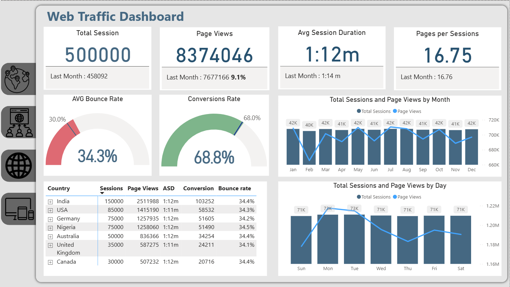

# **Web Traffic Analytics Dashboard - Power BI**

### **Overview**
This project presents an interactive Web Traffic Dashboard that provides a comprehensive overview of website performance.  
It visualizes key web analytics metrics such as total sessions, page views, average session duration, bounce rate, and conversion rate.  
The dashboard helps in understanding user behavior, engagement patterns, and traffic trends across different countries and time periods.  
It is designed to support data-driven decision-making by tracking performance KPIs and identifying opportunities for optimization.  

### **Key Features**
- Track total sessions and page views  
- Monitor average session duration and pages per session  
- Check bounce rate and conversion rate  
- View traffic by country  
- Analyze monthly and daily trends  

## **Dashboard Screenshot**

